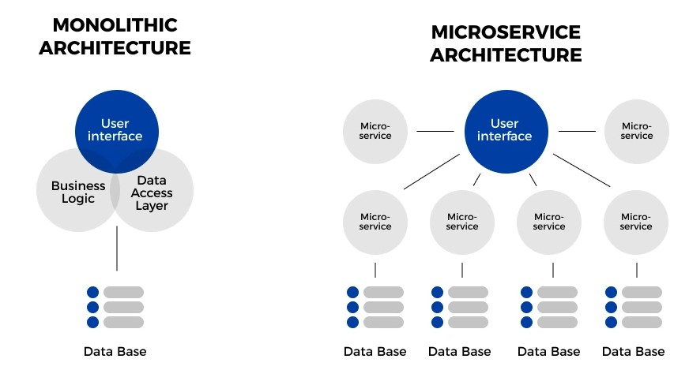
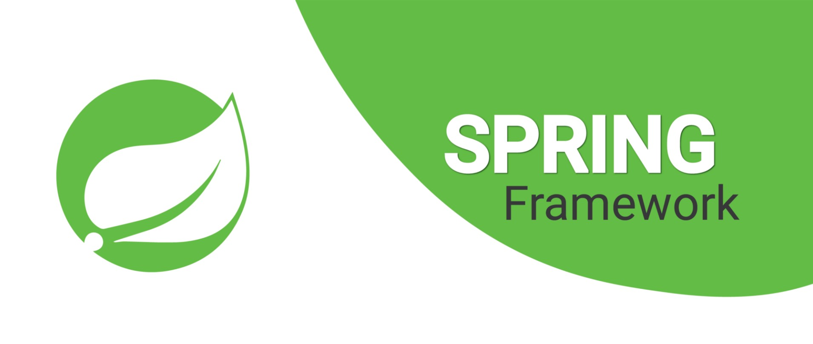
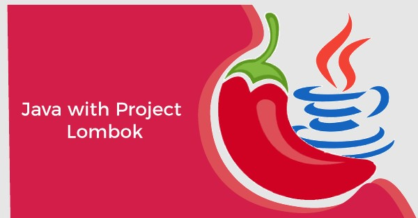

# Ejercicio Microservicios

<!-- TOC -->
* [Ejercicio Microservicios](#ejercicio-microservicios)
  * [Introducción](#introduccin)
  * [Arquitectura de Microservicios](#arquitectura-de-microservicios)
    * [Monolitos](#monolitos)
    * [Microservicios](#microservicios)
  * [Frameworks](#frameworks)
    * [Spring](#spring)
    * [Lombok](#lombok)
<!-- TOC -->

## Introducción

Para este ejercicio usaremos diferentes conceptos y tecnologías que aclararemos antes de empezar la práctica:
- Java
- Frameworks
  - Spring (Spring boot, Spring MVC, Spring Data)
  - Lombok
  - Hibernate
- Contenedores (Docker, docker-compose)
- Build tools (Gradle)
- APIs REST
- Debugger
- Logging
- Testing (Unit tests, Integration Tests)

## Arquitectura de Microservicios

### Monolitos

Los microservicios no se entienden sin saber que existía antes de que se inventaran. Tradicionalmente, las aplicaciones 
se construían con todo el codigo junto, un conglomerado de código para hacer funcionar cada parte de
la aplicación. Esto lo llamaremos "monolito".

Si nunca has creado una aplicación grande, seguramente sin saberlo, optarás por crear un monolito. Es la forma más rápida
de hacer una aplicación, y sus desventajas no son evidentes hasta que llevas muchos años de desarrollo. Este es el problema
de muchas empresas hoy en dia, que mantienen productos enormes, con millones de líneas de código, y que tienen un verdadero
quebradero de cabeza para mantener y escalar su aplicación.

Veamos las principales desventajas de los monolitos:
- **_Fuerte acoplamiento:_** El código no está separado, cualquier desarollador puede usar una clase de una parte del proyecto en otra donde no deberia usarse. Esto lleva a gran acoplamiento entre clases, y la consecuencia es que cambiar ese código sera muy dificil,  porque se usa en muchos sitios.
- **_Atado a la tecnología:_** En un monolito no podemos elegir usar Java para una parte y Python para otra, ni siquiera usar una versión diferente del compilador (JDK 8 or JDK 17). Algo parecido pasa con las bases de datos o los frameworks. Y también se hace muy dificil actualizar esas dependencias; Cambiar de version de Java a un proyecto de millones de lineas no es tarea facil.
- **_Limitaciones de Escalado:_** Qué es escalar? escalar es crear más instancias de tu aplicacion para soportar una carga de trabajo más grande. En no suele estar diseñado para escalar; se suelen diseñar pensando que solo habrá una instancia de este. Incluso si pudiera escalar, habria que escalar la aplicacion entera, no tenemos la posibilidad de escalar solamente la parte de la aplicación que está sufriendo una alta demanda -> gasto inecesario de recursos
- **_Punto único de fallo:_** En caso de que algo falle en el monolito, podría llegar a afectar a toda la aplicación, lo cual se conoce como un single point of failure (SPOF)

### Microservicios
Microservicios vienen a romper el monolito. "Divide and Conquer". En arquitectura de microservicios dividimos las areas de nuestra
aplicacion en aplicaciones mas pequeñas, que son independientes unas de otras, y se comunican por APIs o Eventos. 

Estas son las principales ventajas al usar una arquitectura de microservicios:
- **_Libertad tecnológica:_** Debido a que los microservicios son proyectos independientes incluso a nivel de base de datos, da la agilidad para decidir e implantar la tecnología a utilizar en función de los requisitos de negocio para cada caso.

- **_Desacoplamiento:_** Alto desacoplamiento, cada microservicio gestiona su propio dominio sin depender de otros.

- **_Escalabilidad:_** A la hora de escalar, solo se escalan los microservicios que hagan falta, a diferencia de un monolito, en el que es necesario escalar toda la aplicación.

- **_Mantenibilidad:_** Los proyectos basados en microservicios son más fáciles de mantener debido a que, en comparación con un monolito, tienen menos código y son más especializados y específicos. Cada microservicio tiene (debe tener) una única responsabilidad.

Ya hemos aprendido un poco de los monolitos y microservicios, y parece que son los malos de la película, pero no es así. No podemos decir 
que los microservicios sean mejor que los monolitos, son diferentes arquitecturas, igual de válidas, que debemos usar dependiendo
de los requisitos que tengamos para la aplicación que vamos a crear. Con la versatilidad de los microservicios tambien vienen otras
desventajas que  es importante que conozcas:

- **_Complejidad:_** Una arquitectura de microservicios puede llegar a ser muy compleja, debido a que intervienen muchos factores por el hecho de que la aplicación está distribuida en distintos proyectos e infraestructuras en los que hay que tener en cuenta factores distintos, como por ejemplo la comunicación entre los microservicios, seguridad, orquestación, coreografía, resiliencia, latencia, consistencia de los datos, etc.

- **_Pruebas y trazabilidad:_** Al ser un contexto distribuido, el coste para implantar y ejecutar las pruebas es más complicado, y lo mismo sucede con la trazabilidad, lo cual requiere la implantación de herramientas específicas para ello.

- **_Consistencia eventual de datos:_** Debido a que cada microservicio debe tener —o es recomendable que tenga— su propia base de datos para gestionar su dominio, surgen problemas como el caso de la “consistencia eventual de los datos” que el proyecto debe asumir y gestionar.

- **_Infraestructura:_** Los microservicios requieren más infraestructura, sobre todo en lo que se refiere a la comunicación entre los microservicios (East-West traffic), y más aún si se opta por una solución basada en eventos (event-driven microservice architecture).

Os dejo un enlace a un video donde el VP de Ingeniería de Spotify explica por qué y cómo la arquitectura de microservicios 
ayuda a Spotify a dar servicios a millones de usuarios, con diferentes dispositivos (PC, TV, Móvil...) y un buen tiempo de respuesta

https://www.youtube.com/watch?v=7LGPeBgNFuU

## Frameworks

### Spring

Spring es un framework de desarrollo de aplicaciones en Java. Fue creado para simplificar y agilizar el desarrollo de aplicaciones empresariales, promoviendo buenas prácticas de programación y ofreciendo una amplia gama de funcionalidades y características.

Spring proporciona un enfoque basado en inversión de control (IoC), lo que significa que el control de la aplicación se delega al framework en lugar de ser controlado directamente por el código escrito por el desarrollador. Esto permite una mayor modularidad y flexibilidad en el desarrollo de aplicaciones.

Spring se compone de módulos que se pueden utilizar de forma independiente o combinada para crear una aplicación. Algunos de los módulos más conocidos y utilizados son:

- **_Spring Core:_** Proporciona la base del framework, incluyendo el contenedor de inversión de control (IoC Container) y el mecanismo de inyección de dependencias. Permite la configuración y administración de los componentes de la aplicación.

- **_Spring MVC:_** Proporciona un marco de desarrollo para la creación de aplicaciones web basadas en el patrón Modelo-Vista-Controlador (MVC). Facilita la implementación de controladores, vistas y la comunicación entre ellos.

- **_Spring Data:_** Simplifica el acceso y la manipulación de datos en aplicaciones mediante la integración con diferentes tecnologías de persistencia de datos, como bases de datos relacionales, NoSQL y servicios web.

- **_Spring Security:_** Proporciona funciones de seguridad y autenticación para aplicaciones web y servicios. Permite la gestión de roles, permisos, autenticación de usuarios y protección de recursos.

- **_Spring Boot:_** Es una extensión de Spring que simplifica aún más el proceso de configuración y desarrollo de aplicaciones, ofreciendo un enfoque de "opinión sobre la convención". Spring Boot incluye un servidor embebido y puede generar aplicaciones listas para desplegar de forma sencilla.

### Lombok

Lombok es un framework de Java que se utiliza para simplificar el desarrollo de aplicaciones eliminando la necesidad de escribir código repetitivo y boilerplate. Su objetivo principal es reducir la cantidad de código "aburrido" que los desarrolladores tienen que escribir para crear clases Java, como los getters y setters, constructores, métodos equals y hashCode, y otros métodos comunes.

Lombok logra esto a través de anotaciones que se agregan al código fuente de Java. Estas anotaciones instruyen a Lombok para generar automáticamente el código correspondiente durante el proceso de compilación. Esto significa que, en lugar de tener que escribir manualmente todos los métodos de acceso y otros bloques de código tediosos, Lombok se encarga de generarlos por nosotros.

Algunas de las anotaciones más comunes proporcionadas por Lombok incluyen:

- **`@Getter` y `@Setter`:** Generan automáticamente los métodos getter y setter para los campos de una clase.
- **`@ToString`:** Genera el método `toString()` que devuelve una representación legible de la clase.
- **`@EqualsAndHashCode`:** Genera los métodos `equals()` y `hashCode()` basados en los campos de la clase.
- **`@NoArgsConstructor`, `@RequiredArgsConstructor` y `@AllArgsConstructor`:** Generan constructores sin argumentos, constructores con argumentos para los campos requeridos y constructores con argumentos para todos los campos, respectivamente.
- **`@Data`:**  combina varias otras anotaciones de Lombok, como `@Getter`, `@Setter`, `@ToString`, `@EqualsAndHashCode` y `@RequiredArgsConstructor`.

### Hibernate

Hibernate es un framework de mapeo objeto-relacional (ORM) para Java. Su objetivo principal es simplificar y agilizar el desarrollo de aplicaciones que interactúan con bases de datos relacionales. Hibernate proporciona una capa de abstracción entre la aplicación y la base de datos, permitiendo que los objetos de la aplicación sean almacenados, actualizados y consultados en la base de datos de manera transparente y orientada a objetos.

El funcionamiento de Hibernate se basa en el mapeo de objetos Java a tablas de la base de datos y viceversa. A través de anotaciones o archivos de configuración XML, Hibernate establece la correspondencia entre las clases Java y las tablas de la base de datos, así como entre los atributos de las clases y las columnas de las tablas.

## REST APIs

Una API REST se basa en los principios fundamentales de REST, que incluyen:

- **Recursos:** Los recursos son elementos identificables (como datos, servicios o funcionalidades) que se pueden acceder y manipular a través de la API. Cada recurso tiene una identificación única (URI) y puede tener diferentes representaciones, como JSON o XML.

- **Verbos HTTP:** Los verbos HTTP, como GET, POST, PUT y DELETE, se utilizan para realizar operaciones sobre los recursos. Estos verbos indican la acción que se desea realizar en el recurso identificado por su URI.

- **Estado de representación:** La respuesta de una solicitud a la API REST debe incluir toda la información necesaria para comprender o modificar el recurso solicitado. Esto significa que cada respuesta debe incluir los datos del recurso solicitado, así como metadatos adicionales, como códigos de estado HTTP.

- **Sin estado:** Cada solicitud a una API REST debe ser independiente y no debe depender de solicitudes anteriores. Esto significa que el servidor no debe mantener el estado de la sesión del cliente y que todas las solicitudes deben incluir toda la información necesaria para ser procesadas.

Las API REST se utilizan para crear servicios web que permiten la comunicación y la interoperabilidad entre diferentes sistemas. Pueden ser utilizadas por aplicaciones web, aplicaciones móviles u otros sistemas para realizar operaciones como obtener datos, crear, modificar o eliminar recursos.

Los verbos de HTTP se usan de la siguiente manera:

| Verbo HTTP | Cometido                                              |
|------------|-------------------------------------------------------|
| GET        | Obtiene un recurso o una colección de recursos.        |
| POST       | Crea un nuevo recurso basado en los datos proporcionados. |
| PUT        | Actualiza completamente un recurso existente con los nuevos datos proporcionados. |
| PATCH      | Actualiza parcialmente un recurso existente con los cambios especificados. |
| DELETE     | Elimina un recurso existente.                          |
| HEAD       | Obtiene solo los metadatos de un recurso sin recuperar el cuerpo de respuesta. |
| OPTIONS    | Obtiene las opciones y/o características de comunicación disponibles para un recurso. |

Aquí tienes una lista de algunos códigos de estado HTTP comúnmente utilizados en APIs REST:

| Código  | Descripción                                                |
|---------|------------------------------------------------------------|
| 200     | OK - La solicitud ha sido exitosa.                         |
| 201     | Created - Se ha creado exitosamente un nuevo recurso.       |
| 204     | No Content - La solicitud se ha procesado correctamente, pero no hay contenido para devolver. |
| 400     | Bad Request - La solicitud no pudo ser entendida o contiene parámetros inválidos. |
| 401     | Unauthorized - La solicitud requiere autenticación o la autenticación ha fallado. |
| 403     | Forbidden - El servidor ha entendido la solicitud, pero se niega a cumplirla. |
| 404     | Not Found - El recurso solicitado no se encuentra disponible. |
| 405     | Method Not Allowed - El método de solicitud utilizado no está permitido para el recurso solicitado. |
| 500     | Internal Server Error - Se ha producido un error interno en el servidor. |
| 503     | Service Unavailable - El servidor no está disponible actualmente debido a sobrecarga o mantenimiento. |

## Parte Práctica

## Requisitos

- Docker Desktop 
- JDK 17
- Git
- Postman Desktop Agent

# Descripción de la Práctica

# Detalles técnicos

## Modelo de datos (Entities vs DTOs)
## API Controllers

Tutorial de como crear un Controller en Spring: https://spring.io/guides/tutorials/rest/

## API Error Handlers

## Servicios

## Repositories
